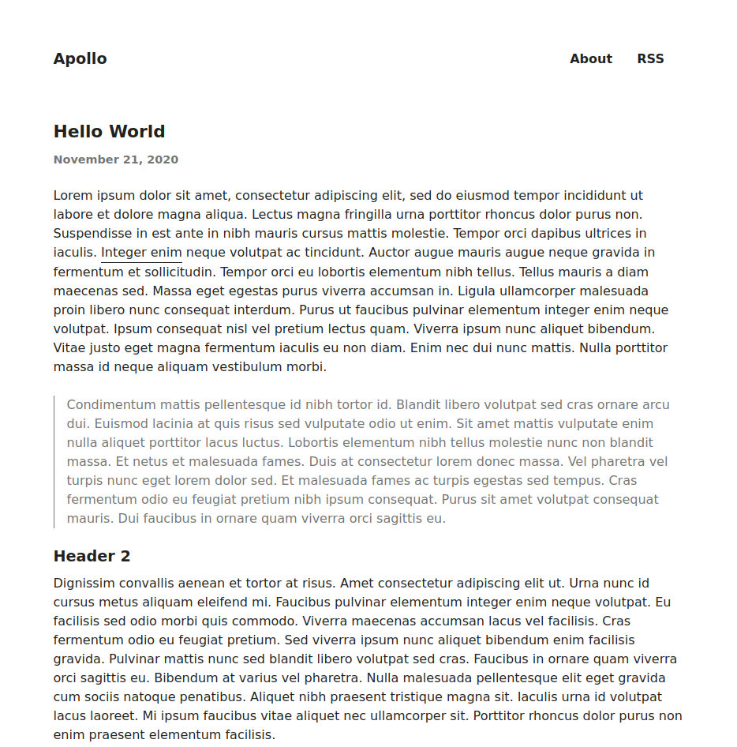

# Apollo



---

- [Features](#features)
- [Code highlighting](#code-highlighting)
- [Getting Started](#getting-started)
- [Post Archetype](#post-archetype)
- [Reporting an Issue](#reporting-an-issue)
- [Apollo User](#apollo-user)
- [License](#license)

## Features

- Simple design
- No external build tools
- Fully responsive
- [PrismJS](https://prismjs.com)
- [Mathjax](https://www.mathjax.org/)

## Code Highlighting

Syntax highlighting is provided by [PrismJS](https://prismjs.com/). All you need to do is wrap your code as follows:

<pre>
```go
package main

import "fmt"

func main() {
    fmt.println("Hello, world!")
}
```
</pre>

## Getting Started

To get setup with this theme quickly, run the commands below from your hugo sites root.

```bash
git submodule add https://github.com/karlbateman/apollo.git themes/apollo
```

Once the theme is installed you'll want to run the following command to get a simple site configured, from here you can
make the necessary adjustments to suite your needs.

```bash
cp -r themes/apollo/exampleSite/. .
```

## Post Archetype

See the basic file params supported by the theme -- [archetypes/post.md](archetypes/post.md)

## Reporting an Issue

If you spot any bugs, please use the [issue tracker](https://github.com/karlbateman/apollo/issues) or create a
[pull request](https://github.com/karlbateman/apollo/pulls) if you wish to fix the issue yourself.

## Apollo User

If your using this theme, please reach out and I'll create a list of Apollo users with a link to your site.

## License

[BSD](LICENSE) © [@karlbateman](https://github.com/karlbateman)
